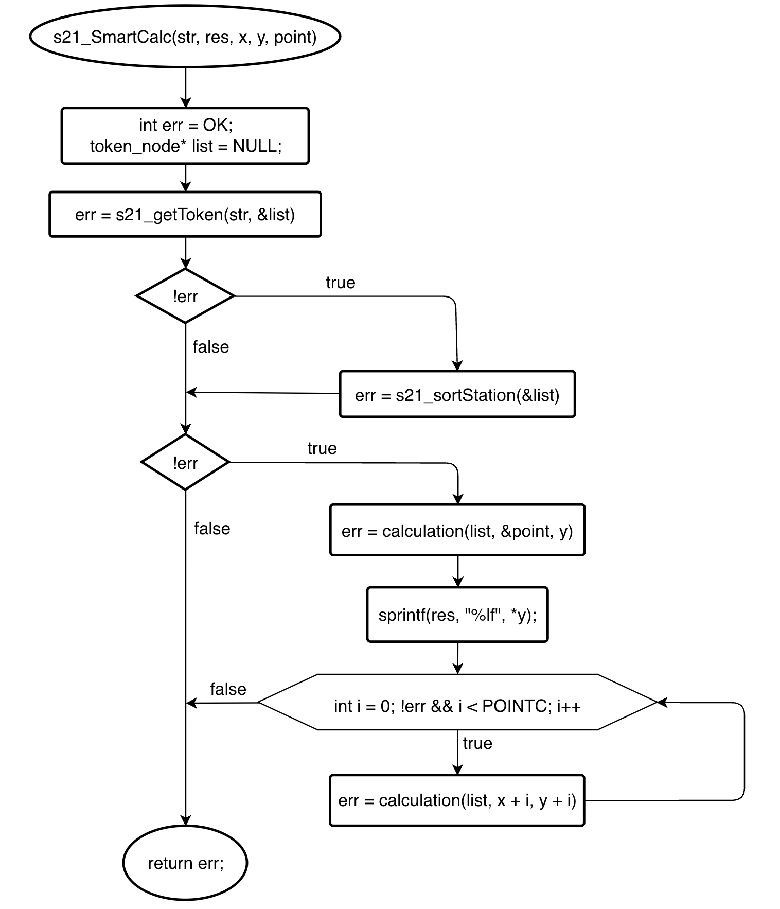
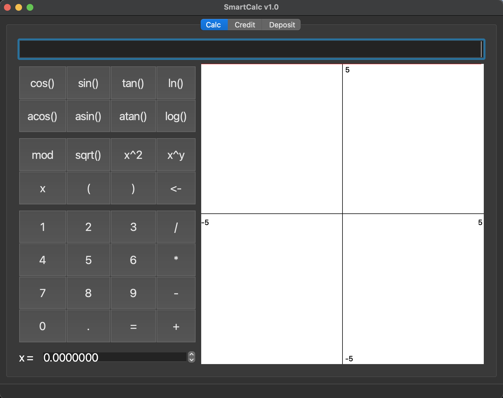
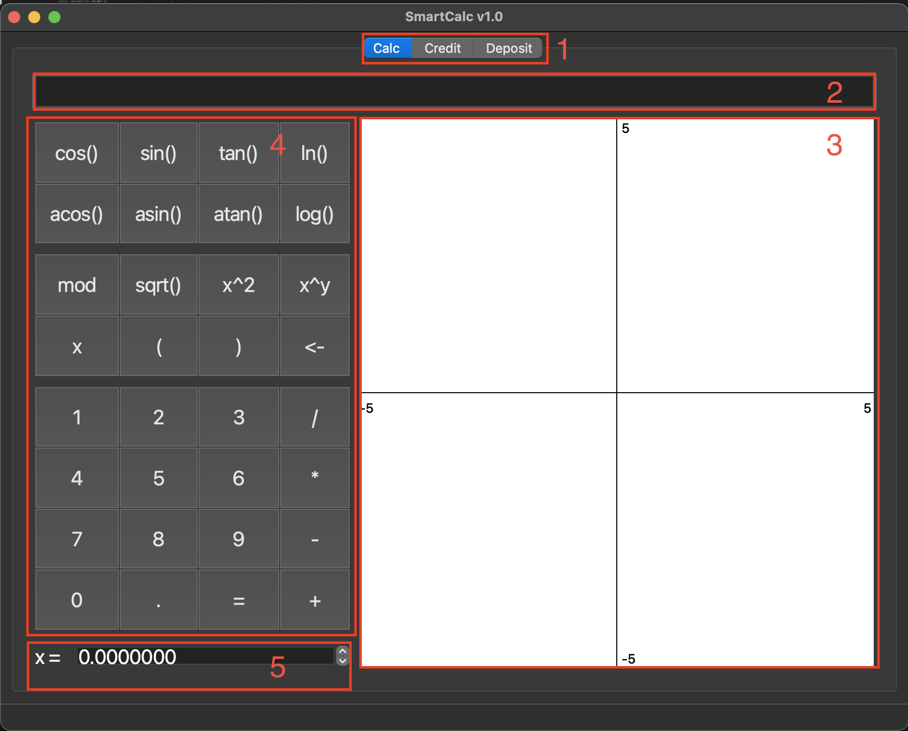
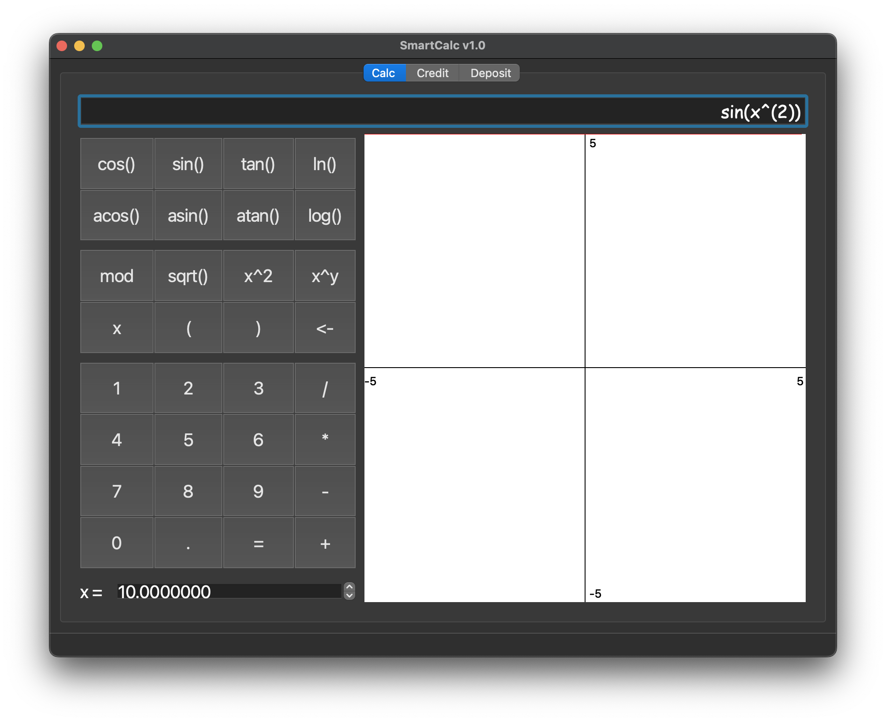
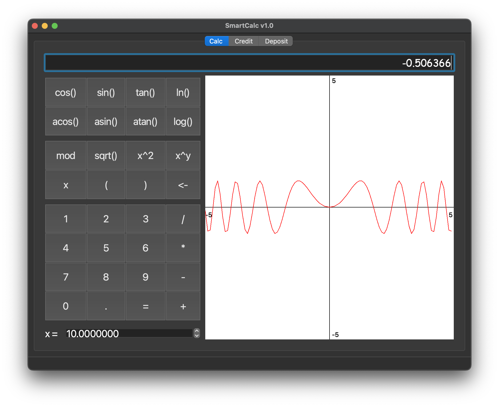
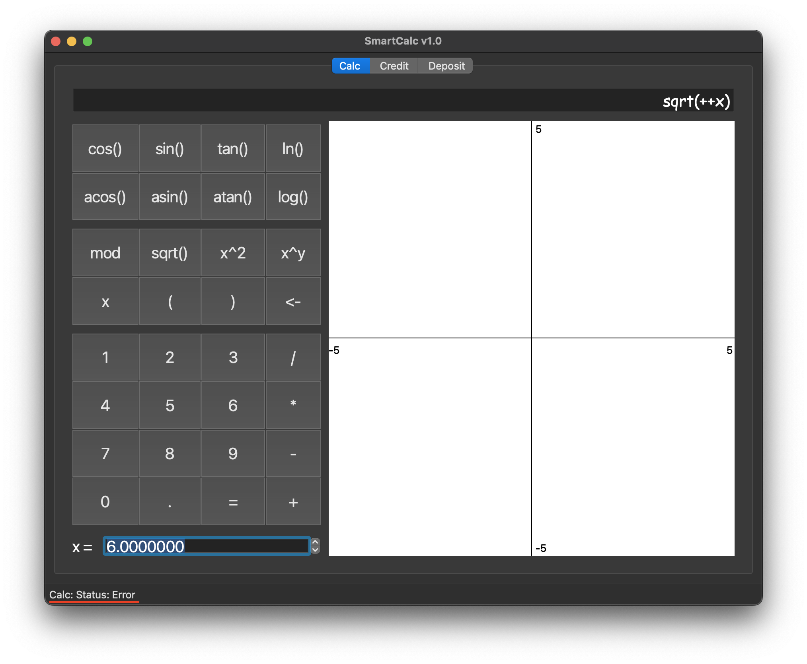
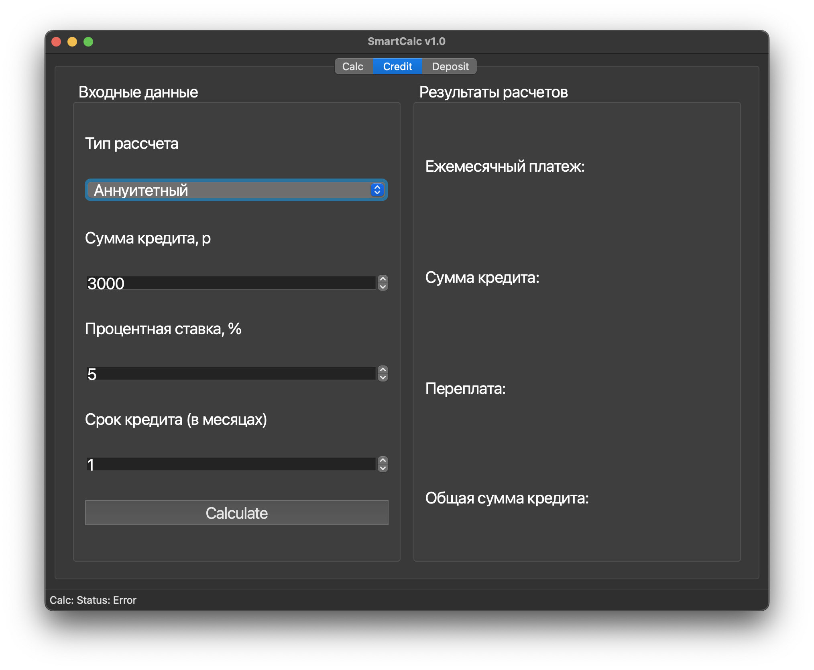
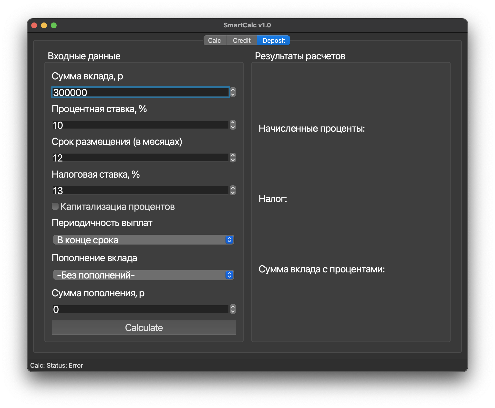

# SmartCalc v1.0

## Содержание

1. [Makefile](#makefile)
2. [Обзор кода](#обзор-кода)
3. [Обзор приложения SmartCalc v1.0](#обзор-приложения-smartcalc-v10)


## Makefile


- `install`  
Установка приложения `SmarCalc.app` в директорию build, так же создается  
копия на рабочем столе

- `uninstall`  
Удаление калькулятора

- `clean`  
Удаление всех файлов, полученных в процессе выполнения целей `Makefile`

- `dvi`  
Открытие документации по проекту  

- `dist`  
Содание архива `.tgz`, архивируются исполняемый файл и документация по проекту

- `test`  
Запуск unit-тестов, покрывающие модули, связанных с вычислением выражений

- `gcov_report`  
Создание html отчета, содержащий информацию об объёме покрытия кода тестами


## Обзор кода

Вычисление выражений произзводтся функцией следующей функцией:

```
int s21_SmartCalc(char* str, char* res, double* x, double* y, double point);
```

Данная функция принимает следующие переменные:

- **str** - указатель на строку с выражением в инфиксной форме
- **res** - указатель на троку для записи результата
- **x, y** - указатели на массивы вещественных чисел,  
используются для построенния графиков вункции
- **point** - вещественное число, используется для  
расчёта значения функции в точке `x = point`

Упрощенная блок схема функции s21_SmartCalc:  

  

Последующее описание алгоритма будет опираться на блок схему выше.  

Внутри функции s21_SmartCalc() объявлены следующие переменные:

- **err** - переменная содержащая код ошибки  
    Возможны следующие ошибки:  
    - *OK* - функция отработала без ошибок
    - *NULLPTR* - ошибка выделении памяти
    - *NO_NULL_LIST* - ошибка инициализации списка, список не пустой
    - *ERROR_ELEM* - ошибка в выражении, выражение содержит токен,  
    который не определен или выражение не возможно вычислить
- **list** - указатель на односвязанный список  
    Структура описывающая данный список:  
    ```
    struct s21_calc {  
      func arg;  
      double val;  
      struct s21_calc* next;  
    };  
    typedef struct s21_calc token_node;  
    ```  
    Каждый узел хранит следующую информацию:  
    - *arg* - имя токена, по которому определяется, является токен оператором, числом или переменной.  
    - *val* - численное значение токена, в случае если токен число или переменная  
    - *next* - укзатель не следующий узел списка  

Ниже представлен пример работы функции:  
- Пусть к нам пришла строка `"2+x"` тогда функция s21_getToken() создаст следующий список:  
`list -> (NONE, 2.0) -> (SUM, nan) -> (X, nan) -> NULL`  
- Затем список сортируется в функции s21_sortStation(), используя алгоритм Дейкстры:  
`list -> (NONE, 2.0) -> (X, nan) -> (SUM, nan) -> NULL`  
- Дальше производится расчет, на основе полученного списка, в функции calculation().  
Сама функция calculation() принимает, помимо списка, указатели на переменные `x` и `y`,  
для подставления значения **x** в соответсвующие узлы списка, и для записи результата расчетов.  

## Обзор приложения SmartCalc v1.0

Окно приложения:

  

Данное окно состоит из следующих частей:

  

1. Вкладки для перехода между инженерным, кредитным и депозитным калькуляторами  
2. Строка ввода математического выражения  
3. Поле графика, на котором будет отрисовываться функция  
4. Встроенная клавиатура  
5. Значение **х**, для расчета функции в одной точке  

Математическое выражение в стоке ввода воспринимается как функция от **х**.  
После нажатия кнопки `=` на встроенной клавиатуре, в строке ввода печатается  
результат расчета (значение функции в заданной точке **х**), а в окне отображается  
график введенной функции.


Пример:

  
  

При некорректном вводе математического выражения, внизу окна появится сообщение об ошибке:

  

Так же приложение поддерживает ввод с клавиатуры пользователя.  

Ниже представленны отображение кредитного и депозитного калькуляторов:  

  
  

