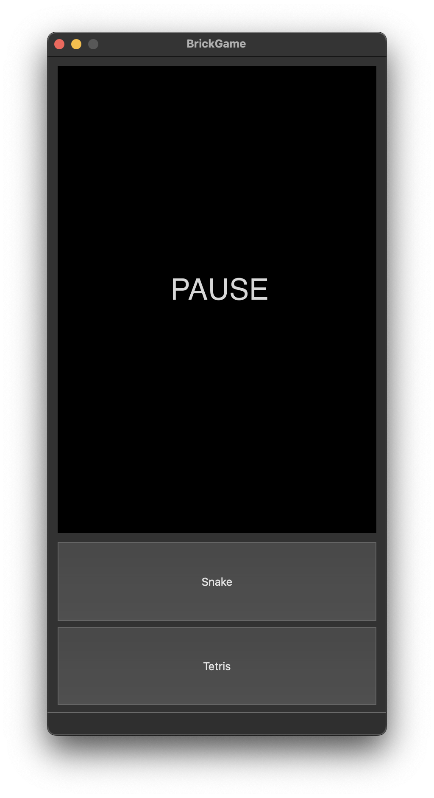
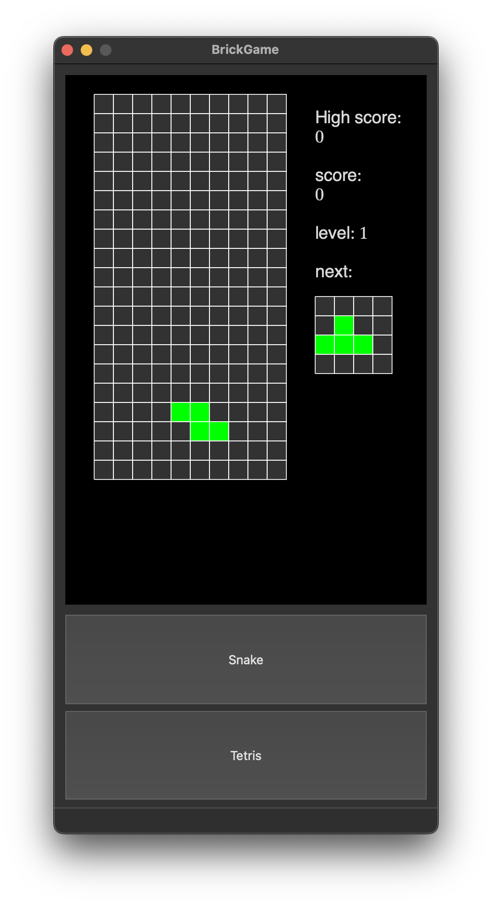
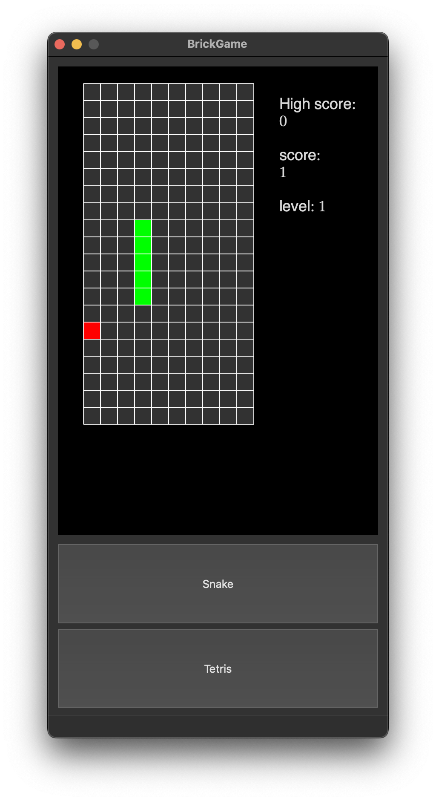

# BrickGame v2.0

## Содержание

1. [Обзор кода](#обзор-кода)
2. [Обзор приложения BrickGame v2.0](#обзор-приложения-smartcalc-v10)


## Обзор кода  

### Патерн MVC  

**1. Model**  

- В проекте модель каждой игры, является реализацией абстрактного класса `s21::Model`:  
```
  class Model {
   protected:
    GameInfo_t modelData_;
    int count_;
    const int *level_;
    FileManager fManager_;

   public:
    Model();
    virtual ~Model();

    void FSMachine(UserAction_t signal, bool hold);
    GameInfo_t &getModelInfo();

   protected:
    void ModelMenu(UserAction_t signal);
    virtual void PlayMenu(UserAction_t signal) = 0;
    virtual bool Move() = 0;
    virtual void InitModel() = 0;
    virtual void ClearModel() = 0;
    virtual void Clash() = 0;
  };
```

- В данном интерфейсе описаны следующие методы:  
  - `Model::FSMachine(UserAction_t signal, bool hold)`:  
  основная часть конечного автомата, которая определяет поведение модели в отсутсвии входных данных  
  - `Model::ModelMenu(UserAction_t signal)`:  
  при нажатии пользователем клавиши (hold = true), конечный автомат передает код каманды в меню модели;  
  данный метод определяет реакцию модели на входной сигнал, в зависимости от текущего режима модели (ModelPlay/ModelPause/GameOver)  
  - `Model::getModelInfo()`:  
  геттер модели, позволяющий получить доступ к игровым данным модели, небходимых для gui  

- От интерфейса `s21::Model` наследуются следующие классы:  
  - `s21::SnakeModel`: модель игры "Змейка"  
  - `s21::TetrisModel`: модель игры "Тетрис"  

**2. Controller**  

```
  class Controller {
   private:
    Model* game_;

   public:
    Controller(Model*&& newGame);
    ~Controller();

    void userInput(UserAction_t action, bool hold);
    GameInfo_t updateCurrentState();
    void ChangeModel(Model*&& Game);
  };
```

- Контроллер представляет из себя простой менеджер моделей. Реализованные методы:  
  - `Controller::userInput(...)`: отправление управляющих сигналов в модель  
  - `Controller::updateCurrentState()`: получение игровой информации от модели  
  - `Controller::ChangeModel(...)`: замена текущей модели на модель другой игры  

**3. View**

- Были реализованы две версии игры:
  - desktop - реализованная с использованием Qt  
  цель для Makefile: `install`
  - terminal - реализованная с использованием библиотеки ncurses  
  цель для Makefile: `terminal`

## Обзор приложения BrickGame v2.0  

- Начальное окно:  
    
  По умолчанию запущена игра `Tetris`, которая стоит на паузе. На окне расположенны дисплей и кнопки переключения игры.  

- Ниже приведены изображение окна, при запущенных играх:  
  
  

